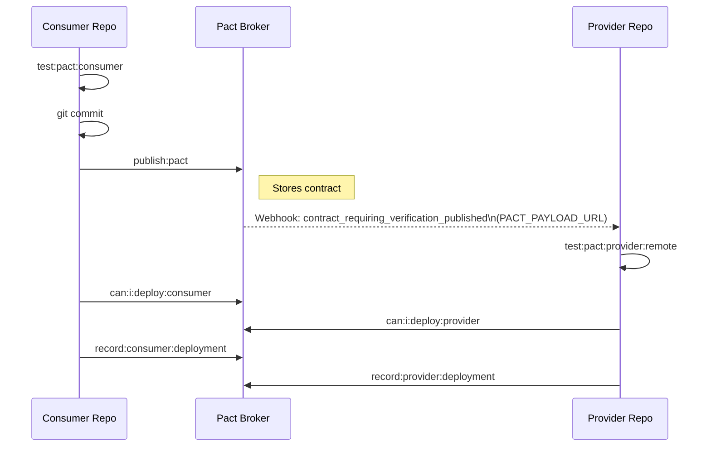

# pactjs-utils

A collection of utilities for Pact.js contract testing, designed to eliminate boilerplate and enforce best practices for consumer-driven contract testing.

📚 **[View the full documentation on GitHub Pages](https://seontechnologies.github.io/pactjs-utils/)** or browse the [docs folder](./docs)

## Table of Contents

- [pactjs-utils](#pactjs-utils)
  - [Table of Contents](#table-of-contents)
  - [Why This Library](#why-this-library)
  - [Quick Start](#quick-start)
    - [Consumer: Creating provider states with typed params](#consumer-creating-provider-states-with-typed-params)
    - [Provider: Building verifier options with one call](#provider-building-verifier-options-with-one-call)
    - [Auth: Injecting request filters](#auth-injecting-request-filters)
    - [Message/Kafka provider verification](#messagekafka-provider-verification)
  - [Installation](#installation)
  - [Utilities](#utilities)
  - [Pact Testing Types](#pact-testing-types)
    - [Pact folder structure](#pact-folder-structure)
  - [Contract Testing Flows](#contract-testing-flows)
    - [Local Flow (no Pact Broker)](#local-flow-no-pact-broker)
    - [Remote Flow (with Pact Broker)](#remote-flow-with-pact-broker)
    - [Provider-Driven Flow (Bi-Directional / BDCT)](#provider-driven-flow-bi-directional--bdct)
  - [CI Workflows](#ci-workflows)
  - [Testing](#testing)
  - [Development](#development)
  - [Module Format Support](#module-format-support)
  - [Testing the Package Locally](#testing-the-package-locally)
  - [Release and Publishing](#release-and-publishing)
    - [Publishing via GitHub UI (Recommended)](#publishing-via-github-ui-recommended)
    - [Publishing Locally](#publishing-locally)
  - [Contributing](#contributing)
  - [License](#license)

## Why This Library

Pact.js is powerful but that power may come with friction for some teams. This library removes the repetitive parts so you can focus on writing contracts, not plumbing.

- **JsonMap conversion headaches** -- Pact expects `JsonMap` for provider state params, but your code uses typed objects. `createProviderState` and `toJsonMap` handle the conversion so you never think about it.
- **Express middleware type gymnastics** -- Injecting auth tokens into Pact verification requests requires wrestling with Express request/response types. `createRequestFilter` wraps this into a single call with a pluggable token generator.
- **Scattered verifier configuration** -- Building `VerifierOptions` means assembling broker URLs, consumer selectors, state handlers, request filters, and version tags from multiple sources. `buildVerifierOptions` and `buildMessageVerifierOptions` consolidate this into one configuration object.
- **Cross-execution bugs in CI** -- When multiple provider-consumer pairs share a CI pipeline, getting consumer version selectors, breaking change flags, and webhook payloads right is error-prone. `handlePactBrokerUrlAndSelectors` reads environment variables and assembles the correct selector strategy automatically.

## Quick Start

### Consumer: Creating provider states with typed params

```typescript
// pact/http/consumer/movies-read.pacttest.ts
import { createProviderState } from '@seontechnologies/pactjs-utils'

// Instead of manually converting to JsonMap:
const state = createProviderState({
  name: 'Has a movie with a specific ID',
  params: { id: 1, name: 'Inception', year: 2010 }
})

// Use with pact.addInteraction().given():
await pact.addInteraction().given(...state)
```

### Provider: Building verifier options with one call

```typescript
// pact/http/provider/provider-contract.pacttest.ts
import { buildVerifierOptions } from '@seontechnologies/pactjs-utils'

const options = buildVerifierOptions({
  provider: 'SampleMoviesAPI',
  port: '3001',
  stateHandlers,
  includeMainAndDeployed: process.env.PACT_BREAKING_CHANGE !== 'true',
  requestFilter: createRequestFilter({
    tokenGenerator: () => generateAuthToken({ userIdentifier: 'admin' })
  })
})

const verifier = new Verifier(options)
await verifier.verifyProvider()
```

### Auth: Injecting request filters

```typescript
// pact/http/helpers/pact-helpers.ts
import { createRequestFilter } from '@seontechnologies/pactjs-utils'

// Custom token generator
const filter = createRequestFilter({
  tokenGenerator: () =>
    `${new Date().toISOString()}:${JSON.stringify({ userId: 'admin' })}`
})

// Default (ISO timestamp token)
const defaultFilter = createRequestFilter()

// No auth needed
import { noOpRequestFilter } from '@seontechnologies/pactjs-utils'
```

### Message/Kafka provider verification

```typescript
// pact/message/provider/provider-message-queue.pacttest.ts
import { buildMessageVerifierOptions } from '@seontechnologies/pactjs-utils'

const options = buildMessageVerifierOptions({
  provider: 'SampleMoviesAPI-event-producer',
  messageProviders,
  stateHandlers,
  includeMainAndDeployed: true
})

const messagePact = new MessageProviderPact(options)
await messagePact.verify()
```

## Installation

```bash
npm i -D @seontechnologies/pactjs-utils
```

> **Note:** This package requires `@pact-foundation/pact >= 16.2.0` as a peer dependency.

## Utilities

| Category     | Utilities                                                                                                          | Docs                                                                                   |
| ------------ | ------------------------------------------------------------------------------------------------------------------ | -------------------------------------------------------------------------------------- |
| **Consumer** | `toJsonMap`, `createProviderState`                                                                                 | [Consumer Helpers](https://seontechnologies.github.io/pactjs-utils/consumer-helpers)   |
| **Schema**   | `zodToPactMatchers`                                                                                                | [Zod to Pact](https://seontechnologies.github.io/pactjs-utils/zod-to-pact/)            |
| **Provider** | `buildVerifierOptions`, `buildMessageVerifierOptions`, `handlePactBrokerUrlAndSelectors`, `getProviderVersionTags` | [Provider Verifier](https://seontechnologies.github.io/pactjs-utils/provider-verifier) |
| **Auth**     | `createRequestFilter`, `noOpRequestFilter`                                                                         | [Request Filter](https://seontechnologies.github.io/pactjs-utils/request-filter)       |

## Pact Testing Types

Pact supports three types of contract testing. This project implements all three:

| Type                                 | Status      | Cost         | Local | Directory        |
| ------------------------------------ | ----------- | ------------ | ----- | ---------------- |
| **Consumer-Driven (HTTP)**           | Implemented | **Free**     | Yes   | `pact/http/`     |
| **Message Queue (Kafka/async)**      | Implemented | **Free**     | Yes   | `pact/message/`  |
| **Bi-Directional (provider-driven)** | Implemented | PactFlow req | No    | `scripts/` (OAS) |

**Consumer-Driven Contract Testing (CDCT)** -- The consumer defines HTTP interaction expectations, generates pact files, and the provider verifies against them. This is the core Pact workflow. Supports both local and broker modes. (`pact/http/consumer/` for consumer tests, `pact/http/provider/` for provider verification)

**Message Queue Testing** -- The same consumer-driven approach applied to async messaging (Kafka, SQS, etc.). The consumer defines message expectations, and the provider verifies it can produce matching messages using `MessageProviderPact`. Supports both local and broker modes. (`pact/message/consumer/` for consumer tests, `pact/message/provider/` for provider verification)

**Bi-Directional Contract Testing (BDCT)** -- The provider publishes an auto-generated OpenAPI spec to PactFlow, which cross-validates it against consumer pacts. No local mode -- requires PactFlow to perform the cross-validation. The provider's own tests (unit/integration) serve as the verification evidence. (`scripts/publish-provider-contract.sh`)

### Pact folder structure

```text
pact/
  http/                                    # HTTP contract tests (CDCT)
    consumer/                              #   Consumer-driven HTTP expectations
      movies-read.pacttest.ts              #     GET operations
      movies-write.pacttest.ts             #     POST/PUT/DELETE operations
    provider/                              #   HTTP provider verification
      provider-contract.pacttest.ts        #     Verification (local + broker)
    helpers/                               #   HTTP-specific helpers
      pact-helpers.ts                      #     Auth token generation
      state-handlers.ts                    #     Provider state setup (DB seeding)
    vitest.consumer.config.mts             #   HTTP consumer test config
    vitest.provider.config.mts             #   HTTP provider test config
  message/                                 # Message queue contract tests (Kafka/async)
    consumer/                              #   Consumer-side message expectations
      movie-events.pacttest.ts             #     Movie event message expectations
    provider/                              #   Message provider verification
      provider-message-queue.pacttest.ts   #     Verification (local + broker)
    helpers/                               #   Message-specific helpers
      message-providers.ts                 #     Kafka message producers
      state-handlers.ts                    #     Re-exports HTTP state handlers
    vitest.consumer.config.mts             #   Message consumer test config
    vitest.provider.config.mts             #   Message provider test config

scripts/
  publish-provider-contract.sh             # Bi-directional: publish OAS to PactFlow (PAID)

sample-app/backend/src/api-docs/
  openapi.json                             # Auto-generated OpenAPI 3.1.0 spec (from Zod schemas)
```

## Contract Testing Flows

There are three flows: **local** (no broker, for development), **remote** (with Pact Broker, for CI/CD), and **provider-driven** (bi-directional, publishes OAS to PactFlow).

### Local Flow (no Pact Broker)

The local flow is self-contained. This can be used in monorepos, similar to the repo where the sample front & backe ends coexist. The consumer generates pact files, and the provider verifies directly against those local files. No broker, no network, no environment variables needed.

```bash
# 1. Run consumer pact tests — generates pact JSON files in pacts/
npm run test:pact:consumer

# 2. Run provider verification against local pact files
npm run test:pact:provider:local          # Verify CDCT+MQ locally
npm run test:pact:provider:local:contract # (optional - only execute CDCT)
npm run test:pact:provider:local:message  # (optional - only execute message queue)

# Or run both in sequence:
npm run test:pact:local
```

The provider reads the pact files from the `pacts/` directory using `pactUrls` instead of pulling from a broker. This is the fastest way to iterate during development.

### Remote Flow (with Pact Broker)

The remote flow uses a [Pact Broker](https://docs.pact.io/pact_broker) (e.g. [PactFlow](https://pactflow.io/)) to coordinate contracts between repositories. This is how contract testing works in CI/CD with separate consumer and provider repos.

**Setup:** Create a `.env` file (see `.env.example`):

```bash
PACT_BROKER_TOKEN=your_token_here
PACT_BROKER_BASE_URL=https://your-org.pactflow.io
```

**Consumer flow:**

```bash
npm run test:pact:consumer          # (1) Generate pact files

# commit before publishing — publish tags the version with GITHUB_SHA
npm run publish:pact                # (2) Publish to broker

npm run can:i:deploy:consumer       # (4) Check deployment safety

# only on main:
npm run record:consumer:deployment  # (5) Record deployment to environment
```

**Provider flow:**

```bash
npm run test:pact:provider:remote    # (3) Verify CDCT+MQ against broker (triggered by webhook)
npm run test:pact:provider:remote:contract  # (optional - only execute CDCT)
npm run test:pact:provider:remote:message   # (optional - only execute message queue)

npm run can:i:deploy:provider       # (4) Check deployment safety

# only on main:
npm run record:provider:deployment  # (5) Record deployment to environment
```

The key coordination: when there are separate repos, the provider must run verification `(3)` after the consumer publishes `(2)` but before the consumer can check `can-i-deploy (4)`. **Webhooks** automate this trigger -- when the consumer publishes a new pact, the broker fires a webhook that triggers the provider's CI to run verification.



**Environment variables used in remote flow:**

| Variable               | Purpose                                      | Default     |
| ---------------------- | -------------------------------------------- | ----------- |
| `PACT_BROKER_BASE_URL` | Pact Broker URL                              | (required)  |
| `PACT_BROKER_TOKEN`    | Auth token for broker                        | (required)  |
| `GITHUB_SHA`           | Provider/consumer version (commit hash)      | `'unknown'` |
| `GITHUB_BRANCH`        | Provider version branch                      | `'main'`    |
| `PACT_PAYLOAD_URL`     | Direct pact URL (set by webhooks)            | ---         |
| `PACT_BREAKING_CHANGE` | Skip mainBranch/deployedOrReleased selectors | `'false'`   |

**Consumer version selectors** (controlled by `includeMainAndDeployed` param):

| Selector             | When included            | Purpose                                           |
| -------------------- | ------------------------ | ------------------------------------------------- |
| `matchingBranch`     | Always                   | Verify against consumer's matching feature branch |
| `mainBranch`         | `includeMainAndDeployed` | Verify against consumer's main branch             |
| `deployedOrReleased` | `includeMainAndDeployed` | Verify against consumer's deployed versions       |

**Breaking changes:** When the provider introduces a breaking change, set `includeMainAndDeployed: false` (or `PACT_BREAKING_CHANGE=true` in CI) to only verify against matching branches. This prevents failures from incompatible `mainBranch` or `deployedOrReleased` consumer versions while coordinated PRs are in flight.

```bash
# Provider PR with breaking change:
PACT_BREAKING_CHANGE=true npm run test:pact:provider:remote
```

### Provider-Driven Flow (Bi-Directional / BDCT)

Bi-directional contract testing flips the model: instead of running the Pact verifier against a live provider, **both sides publish independently** to PactFlow, which cross-validates the consumer pacts against the provider's OpenAPI spec.

> **No local mode.** BDCT requires PactFlow to perform the cross-validation -- there is no way to run this locally. The consumer-driven flow covers local development needs.

**Consumer flow:**

```bash
npm run test:pact:consumer          # (1) Generate pact files
# commit before publishing — publish tags the version with GITHUB_SHA
npm run publish:pact                # (2) Publish consumer pacts to PactFlow

npm run can:i:deploy:consumer       # (4) Check deployment safety

# only on main:
npm run record:consumer:deployment  # (5) Record deployment to environment
```

**Provider flow:**

```bash
npm run publish:provider:contract   # (3) Generate OAS, run tests, publish to PactFlow

npm run can:i:deploy:provider       # (4) Check deployment safety

# only on main:
npm run record:provider:deployment  # (5) Record deployment to environment
```

The key difference from CDCT: step `(3)` publishes the provider's OpenAPI spec instead of running the Pact verifier against a live provider. PactFlow cross-validates the consumer pacts against the OAS automatically -- no webhooks needed. Both sides can publish independently.

What `publish:provider:contract` does under the hood in this sample repo:

1. Generates a fresh OpenAPI spec from Zod schemas (`openapi.json`)
2. Runs `npm run test:backend` and captures the exit code (usually this would be an api e2e suite that does e2e + schema validation, ensuring that the OpenAPI spec is flawless per actual network data)
3. Publishes the OAS + verification results via `pactflow publish-provider-contract`

## CI Workflows

Each workflow is a standalone file that can be copied to its own repo. The monorepo only matters for local development (`npm run test:pact:local`).

| Workflow                             | Repo     | Trigger               | Purpose                                 |
| ------------------------------------ | -------- | --------------------- | --------------------------------------- |
| `contract-test-consumer.yml`         | Consumer | PR + push to main     | Generate pacts, publish, can-i-deploy   |
| `contract-test-provider.yml`         | Provider | PR + push to main     | Verify HTTP pacts, can-i-deploy         |
| `contract-test-provider-message.yml` | Provider | PR + push to main     | Verify message pacts, can-i-deploy      |
| `contract-test-webhook.yml`          | Provider | PactFlow webhook      | Verify when consumer publishes new pact |
| `contract-test-publish-openapi.yml`  | Provider | Push to main + manual | Publish OAS to PactFlow (BDCT)          |
| `contract-test-local.yml`            | Monorepo | PR + manual           | Local consumer + provider (no broker)   |

**Breaking change detection:** All workflows parse the PR description for a `[x] Pact breaking change` checkbox. When checked, `can-i-deploy` is skipped and provider verification only runs against matching branches. Add the checkbox via the PR template (`.github/PULL_REQUEST_TEMPLATE.md`).

**Webhook setup (one-time):** PactFlow must be configured to fire a GitHub `repository_dispatch` event when a consumer publishes a new pact. This triggers `contract-test-webhook.yml` in the provider repo. You can either:

1. Create the webhook manually in PactFlow UI (Settings > Webhooks) — see [`scripts/one-time-scripts/create-pact-webhook.sh`](scripts/one-time-scripts/create-pact-webhook.sh) for the exact field values
2. Run the script directly with the `pact-broker` CLI after filling in your tokens

Both approaches require a GitHub PAT with `public_repo` scope, stored as a PactFlow secret named `githubToken`. Use [`scripts/one-time-scripts/create-github-issue-test.sh`](scripts/one-time-scripts/create-github-issue-test.sh) to verify your PAT works before creating the webhook.

**Required GitHub secrets:**

| Secret                 | Purpose             |
| ---------------------- | ------------------- |
| `PACT_BROKER_BASE_URL` | PactFlow broker URL |
| `PACT_BROKER_TOKEN`    | PactFlow API token  |

## Testing

```bash
npm run test:lib                    # library unit tests (vitest)
npm run test:backend                # sample-app backend tests
npm run test:frontend               # sample-app frontend tests

npm run test:pact:consumer                 # all consumer contract tests (HTTP + message)
npm run test:pact:consumer:http            # consumer HTTP contract tests
npm run test:pact:consumer:message         # consumer message contract tests

npm run test:pact:provider:local           # provider CDCT+MQ verification (local)
npm run test:pact:provider:local:contract  # provider CDCT verification (local)
npm run test:pact:provider:local:message   # provider message verification (local)

npm run test:pact:local                    # full local flow (consumer + provider)

npm run test:pact:provider:remote          # provider CDCT+MQ verification (broker)
npm run test:pact:provider:remote:contract # provider CDCT verification (broker)
npm run test:pact:provider:remote:message  # provider message verification (broker)
```

## Development

```bash
nvm use
npm install
npm run validate          # typecheck + lint + test + format

npm run test:lib          # library unit tests
npm run test:backend      # sample-app backend tests
npm run test:frontend     # sample-app frontend tests
npm run build             # CJS + ESM + types
```

## Module Format Support

This package supports both CommonJS and ES Modules:

```typescript
// Works in both CJS and ESM
import { buildVerifierOptions } from '@seontechnologies/pactjs-utils'
```

## Testing the Package Locally

```bash
# Build the package
npm run build

# Create a tarball package
npm pack

# Install in a target repository (change the version according to the file name)
# For npm projects:
npm install ../playwright-utils/seontechnologies-playwright-utils-1.0.1.tgz

# For pnpm projects:
pnpm add file:/path/to/playwright-utils-1.0.1.tgz
```

## Release and Publishing

This package is published to the public npm registry under the `@seontechnologies` scope.

### Publishing via GitHub UI (Recommended)

You can trigger a release directly from GitHub's web interface:

1. Go to the repository → Actions → "Publish Package" workflow
2. Click "Run workflow" button (dropdown on the right)
3. Select options in the form:
   - **Branch**: main
   - **Version type**: patch/minor/major/custom
   - **Custom version**: Only needed if you selected "custom" type
4. Click "Run workflow"

**Important**:

- Requires `NPM_TOKEN` secret to be configured in GitHub repository settings
- You must review and merge the PR to complete the process

### Publishing Locally

You can also publish the package locally using the provided script:

```bash
# 1. Set your npm token as an environment variable
# Get your token from: https://www.npmjs.com/settings/~/tokens
export NPM_TOKEN=your_npm_token

# 2. Run the publish script
npm run publish:local
```

## Contributing

See [CONTRIBUTING.md](./CONTRIBUTING.md) for setup, development workflow, and pull request guidelines.

## License

Licensed under the terms of the [LICENSE](./LICENSE) file.
