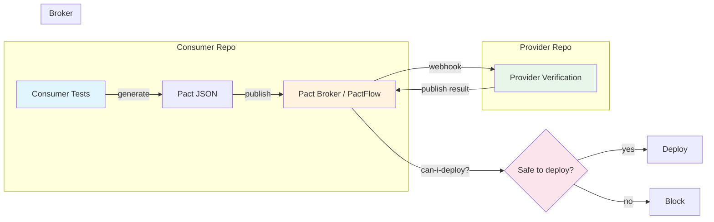
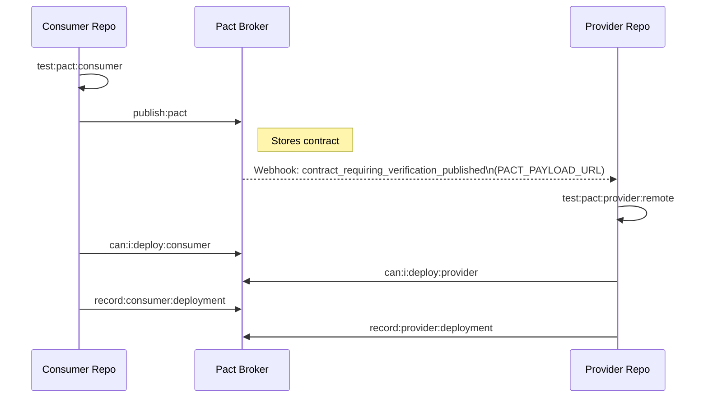

# Concepts

This page covers the concepts behind consumer-driven contract testing and how
they map to `@seontechnologies/pactjs-utils`. For API details, see
[Consumer Helpers](./consumer-helpers/),
[Request Filter](./request-filter/), and
[Provider Verifier](./provider-verifier/).

---

## What is Consumer-Driven Contract Testing?

Contract testing ensures that two systems -- a consumer (e.g., a web
application) and a provider (e.g., a REST API) -- share a mutual understanding
of their interaction. That understanding is captured in a **contract**: a JSON
file describing every request the consumer will make and the response the
provider is expected to return.

### The four actors

| Actor        | Role                                                                                                                          |
| ------------ | ----------------------------------------------------------------------------------------------------------------------------- |
| **Consumer** | The service that initiates requests. It writes tests, which generate a contract file.                                         |
| **Provider** | The service that fulfils requests. It verifies its running implementation against the contract.                               |
| **Contract** | A JSON artefact listing interactions (request/response pairs or messages).                                                    |
| **Broker**   | A central server (Pact Broker or PactFlow) that stores contracts, tracks versions, and coordinates verification via webhooks. |

### Why it replaces certain E2E tests

End-to-end tests that merely check "does endpoint X return status 200 with
the right shape?" duplicate what a contract already guarantees. Contract tests
run locally in milliseconds, require no deployed environment, and give the same
confidence about API compatibility. They do _not_ replace and instead complement E2E tests that  
validate deployments, infrastructure, IAM permissions, or multi-step business workflows --  
those concerns live at a different layer.

### Three approaches

1. **Consumer-Driven Contract Testing (CDCT)** -- The consumer writes tests
   against a mock provider, generates a contract, and publishes it. The provider  
    pulls the contract, runs the server locally and verifies. This is the primary approach the library  
    supports.
2. **Bi-Directional Contract Testing (BDCT)** -- The provider publishes an
   OpenAPI specification, and the consumer tests validate against that spec.  
    Useful when the provider team cannot run Pact verification (e.g., a  
    third-party API) or cannot run the provider server locally.
3. **Message queue testing** -- For asynchronous communication over Kafka,
   RabbitMQ, SQS, or similar. The consumer defines the expected message
   structure; the provider produces that message. The library's
   `buildMessageVerifierOptions` directly supports this approach.

### How it all fits together



**Where pactjs-utils fits:**

| Step                              | Raw Pact                          | With pactjs-utils                                   |
| --------------------------------- | --------------------------------- | --------------------------------------------------- |
| Consumer writes `.given()` params | Manual `JsonMap` casting          | `createProviderState` + `toJsonMap`                 |
| Provider builds verifier options  | 30+ lines of boilerplate per file | `buildVerifierOptions` — one call                   |
| Provider injects auth tokens      | DIY Express middleware            | `createRequestFilter`                               |
| CI routes webhook payloads        | Manual URL parsing                | `handlePactBrokerUrlAndSelectors`                   |
| Breaking changes in CI            | Ad-hoc per team                   | `PACT_BREAKING_CHANGE` flag + selector coordination |

---

## The Consumer Side

On the consumer side you write Pact interactions -- descriptions of requests
your application will make and the responses it expects. Each interaction
follows a structure:

```typescript
pact
  .addInteraction()
  .given(providerState) // what state the provider must be in
  .uponReceiving(description) // human-readable name for this interaction
  .withRequest(method, path) // the HTTP request
  .willRespondWith(response) // the expected response (status, headers, body)
  .executeTest(assertions) // runtime assertions against the mock
```

### Matcher strategy

Pact matchers control how strictly each field in the contract is checked during
verification. Using the wrong matcher is a common source of brittle or
meaningless contracts.

**Key principle**: matchers check **type and shape**, not exact values.
`string('John Doe')` means "any string", not literally "John Doe".
`integer(1)` means "any integer", not the number 1. The example values
serve as documentation and are used by the mock server during consumer tests,
but during provider verification only the type constraint is enforced.

| Matcher      | When to use                                                          | Example                                     |
| ------------ | -------------------------------------------------------------------- | ------------------------------------------- |
| Exact match  | Status codes, HTTP methods, error keys, URL paths                    | `200`, `'GET'`, `'/movies'`                 |
| `like()`     | Response body shapes, nested objects                                 | `like({ name: 'Inception', year: 2010 })`   |
| `string()`   | String fields where the exact value is irrelevant                    | `string('John Doe')`                        |
| `integer()`  | Integer fields (IDs, years)                                          | `integer(1)`                                |
| `decimal()`  | Floating-point fields                                                | `decimal(8.5)`                              |
| `eachLike()` | Array responses (guarantees at least one element matching the shape) | `eachLike(movieObj)`                        |
| `regex()`    | Tokens, timestamps, UUIDs -- values with a known pattern             | `regex(/^\d{4}-\d{2}-\d{2}/, '2024-01-01')` |

The rule: never use exact match for dynamic values (IDs, timestamps). Never use
`like()` for status codes or error keys.

**Requests vs responses** (Postel's Law): be strict with what you send, loose
with what you accept. Use exact values in request bodies -- the consumer knows
exactly what it sends. Use matchers in responses -- the provider may return
different values each time. Avoid wrapping request body fields in `like()`;
it weakens the contract without adding value.

### Interaction naming conventions

Use the format `a request to <action> <resource> [<condition>]`:

- `'a request to get all movies'`
- `'a request to delete a non-existing movie'`

This naming style keeps the Pact Broker UI readable and makes it obvious which
interaction failed during verification.

### Provider state design

Provider states tell the provider what data to prepare before verifying an
interaction. For example, `'An existing movie exists'` signals the provider's
state handler to insert a movie into its database.

**The consumer declares _what_ must exist, the provider decides _how_ to create it.**
Consumer tests use arbitrary placeholder values (e.g., `id: 1`, `name: 'My movie'`).
These are not real provider data -- they are tokens that flow through the contract
to the provider's state handler, which creates matching records in its local database.
The consumer never needs to know about the provider's DB schema or test fixtures.

State parameters must be Pact-compatible JSON (`JsonMap`). In practice, your
domain objects contain types that Pact cannot serialize directly -- nested
objects, `Date` instances, `null`, `undefined`. The library's `toJsonMap`
function handles the conversion transparently, and `createProviderState` wraps
the entire pattern into a single call:

```typescript
// pact/http/consumer/movies-read.pacttest.ts
import { createProviderState } from '@seontechnologies/pactjs-utils'

const [stateName, stateParams] = createProviderState({
  name: 'An existing movie exists',
  params: { name: 'Inception', year: 2010 }
})

// Use in a Pact interaction:
pact.addInteraction().given(stateName, stateParams)
```

Under the hood, `toJsonMap` converts each value to a Pact-safe type:

- `null` / `undefined` become the string `"null"`
- Plain objects become their `JSON.stringify` representation
- `Date` instances become ISO strings
- Numbers and booleans pass through unchanged
- Everything else is coerced via `String()`

This removes the need to manually cast parameters and eliminates the
`@ts-nocheck` workarounds that otherwise accumulate in consumer tests. For the
factory pattern API, see [createProviderState](./consumer-helpers/create-provider-state.md).

---

## The Provider Side

Provider verification answers one question: _does my running service actually
return what the contract says it should?_ The Pact verifier replays every
interaction from the contract against your live server and compares the actual
response to the expected one.

### State handler architecture

Each provider state name in the contract must have a corresponding handler on
the provider side. State handlers are application-specific -- they depend on
your database, ORM, and domain logic. The library does not provide state
handlers; it provides the _types_ for them:

```typescript
// pact/http/helpers/state-handlers.ts
import type { AnyJson } from '@seontechnologies/pactjs-utils'

type ExistingMovieParams = {
  name: string
  year: number
  rating: number
  director: string
}

export const stateHandlers = {
  'An existing movie exists': async (parameters?: AnyJson) => {
    const { name, year, rating, director } = (parameters ??
      {}) as ExistingMovieParams
    const res = await movieService.getMovieByName(name!)
    if (res.status !== 200) {
      await movieService.addMovie({
        name: name!,
        year: year!,
        rating: rating!,
        director: director!
      })
    }
    return { description: `Movie with name "${name}" is set up.` }
  },

  'No movies exist': async () => {
    await truncateTables()
    return { description: 'State with no movies achieved.' }
  }
}
```

State handlers can also declare separate `setup` and `teardown` phases using
the `StateFuncWithSetup` type. The verifier calls state handlers **per
interaction**, not per test. When the verifier replays an interaction that
declares `.given('No movies exist')`:

1. The `setup` function for `'No movies exist'` runs **before** that interaction
2. The interaction replays against the provider
3. The `teardown` function for `'No movies exist'` runs **after** that interaction

If the contract has 9 interactions but only 3 use `'No movies exist'`,
setup/teardown for that state runs 3 times -- only for those 3. This is more
granular than verifier-level hooks which fire for every interaction regardless
of state:

| Scope                                          | Runs when                                                     |
| ---------------------------------------------- | ------------------------------------------------------------- |
| `beforeEach` / `afterEach` in verifier options | Before/after **every** interaction (all 9)                    |
| `setup` / `teardown` in `StateFuncWithSetup`   | Before/after only interactions declaring **that state** (3/9) |

```typescript
// pact/http/helpers/state-handlers.ts
import type { StateHandlers } from '@seontechnologies/pactjs-utils'

const stateHandlers: StateHandlers = {
  // Simple form: function runs during setup phase only
  'An existing movie exists': async (params) => {
    const { name, year } = params as { name: string; year: number }
    await movieService.addMovie({ name, year })
  },

  // Setup + teardown form: separate phases per state.
  // setup runs before each interaction that declares this state,
  // teardown runs after each such interaction completes.
  // Note: TypeScript support has a known issue (pact-js#1164),
  // may require @ts-expect-error until resolved.
  'No movies exist': {
    setup: async () => {
      await truncateTables()
    },
    teardown: async () => {
      // Runs only after interactions using this specific state.
      // Restore default data, re-seed fixtures, etc.
    }
  }
}
```

### Provider verification lifecycle cheat sheet

```text
Jest/Vitest beforeEach     → once, before the whole verifyProvider() call
  Pact beforeEach          → once per interaction (all it blocks from consumer side)
    state handler setup    → once per interaction that declares that state
      interaction execution
    state handler teardown → once per interaction that declares that state
  Pact afterEach           → once per interaction (all it blocks from consumer side)
Jest/Vitest afterEach      → once, after the whole verifyProvider() call
```

Use this mental model when deciding where to place setup and cleanup logic:

- **Test-runner level** (`beforeEach` / `afterEach` in Jest or Vitest): start/stop the
  provider server, run migrations, or set global config. Runs once around the
  entire `verifyProvider()` call.
- **Verifier level** (`beforeEach` / `afterEach` in verifier options): logic that
  must execute for every interaction regardless of state -- e.g., resetting a
  request log or clearing an in-memory cache.
- **State handler level** (`setup` / `teardown`): data preparation and cleanup
  tied to a specific provider state. Only fires for interactions that declare
  that state.

### Auth via request filters (not in the pact file)

Authorization tokens are dynamic -- they change with every test run, every
environment, every deployment. They must _never_ appear in the contract JSON.
Instead, Pact's request filter mechanism injects auth headers at verification
time.

The library's `createRequestFilter` is a higher-order function that returns
a filter conforming to Pact's middleware signature. It adds an `Authorization: Bearer <token>` header to every request that lacks one:

```typescript
// pact/http/provider/provider-contract.pacttest.ts
import { createRequestFilter } from '@seontechnologies/pactjs-utils'
import { generateAuthToken, pactAdminIdentity } from '../helpers/pact-helpers'

const tokenGenerator = () => generateAuthToken(pactAdminIdentity)
const requestFilter = createRequestFilter({ tokenGenerator })
```

The **Bearer prefix contract** is strict and deliberate:

1. Your `tokenGenerator` returns a **raw token value** (no `Bearer` prefix).
2. `createRequestFilter` adds the `Bearer` prefix **exactly once**.
3. If a request already has an `Authorization` header (case-insensitive check),
   the filter leaves it untouched.

This design prevents the double-Bearer bug that occurs when both the generator
and the filter add the prefix.

When no auth is needed, the library exports `noOpRequestFilter`, which passes
requests through without modification. This is the default used by
`buildVerifierOptions` when you omit the `requestFilter` parameter. For
configuration details, see [createRequestFilter](./request-filter/create-request-filter.md).

### Message providers for Kafka and queues

For asynchronous interactions (Kafka, RabbitMQ, SQS), the consumer defines
expected message shapes using `expectsToReceive` and `withContent`. On the
provider side, **message providers** are functions that produce the actual
message payload:

```typescript
// pact/message/helpers/message-providers.ts
import { providerWithMetadata } from '@pact-foundation/pact'
import { produceMovieEvent } from '../../../sample-app/backend/src/events/movie-events'
import { generateMovieWithId } from '../../../sample-app/shared/test-utils/movie-factories'

const movie = generateMovieWithId()

export const messageProviders = {
  'a movie-created event': providerWithMetadata(
    () => produceMovieEvent(movie, 'created'),
    { contentType: 'application/json' }
  ),
  'a movie-updated event': providerWithMetadata(
    () => produceMovieEvent(movie, 'updated'),
    { contentType: 'application/json' }
  ),
  'a movie-deleted event': providerWithMetadata(
    () => produceMovieEvent(movie, 'deleted'),
    { contentType: 'application/json' }
  )
}
```

The library's `buildMessageVerifierOptions` builds the full options object for
message-based verification, applying the same broker URL handling, consumer
version selectors, and version tagging as its HTTP counterpart. See
[Provider Verifier](./provider-verifier/) for the full parameter list.

---

## The Pact Broker

The Pact Broker is the coordination hub for contract testing across
repositories. It stores contracts, tracks which versions are compatible, and
triggers verification automatically.

### GITHUB_SHA and GITHUB_BRANCH for traceability

Every published contract and every verification result is tagged with a
**version** and a **branch**. The library defaults to:

- `providerVersion` = `process.env.GITHUB_SHA` (the commit hash -- unique and
  immutable)
- `providerVersionBranch` = `process.env.GITHUB_BRANCH` (the branch name)

These defaults are set in `buildVerifierOptions` and
`buildMessageVerifierOptions`. When neither environment variable is set (local
development), the version falls back to `'unknown'` and the branch to `'main'`.

### Consumer version selectors explained

When the provider verifies, it needs to know _which_ consumer contract versions
to verify against. Consumer version selectors answer this question.

The library builds selectors internally based on the `includeMainAndDeployed`
flag:

| Selector                       | Meaning                                                                                                                            | When included                           |
| ------------------------------ | ---------------------------------------------------------------------------------------------------------------------------------- | --------------------------------------- |
| `{ matchingBranch: true }`     | The consumer's contract from a branch with the same name as the provider's branch. Enables coordinated feature-branch development. | Always                                  |
| `{ mainBranch: true }`         | The consumer's latest contract from its main branch. Ensures backward compatibility.                                               | When `includeMainAndDeployed` is `true` |
| `{ deployedOrReleased: true }` | The consumer's contract for whatever version is currently deployed in production.                                                  | When `includeMainAndDeployed` is `true` |

When you pass a `consumer` name, that name is added to every selector, scoping
verification to a single consumer. When omitted, the provider verifies against
all consumers that have published contracts for it. For selector scoping and
detailed examples, see [buildVerifierOptions](./provider-verifier/build-verifier-options.md#consumer-version-selectors).

### The Pact Matrix

The Pact Matrix is a broker feature that visualizes the compatibility
relationships between every consumer version and every provider version. It
shows verification status per environment, making it possible to answer
questions like "can version X of the consumer be deployed alongside version Y of
the provider?" The `can-i-deploy` tool queries this matrix.

### Webhook-triggered verification flow

The typical cross-repository flow looks like this:



When the consumer publishes a new contract, the broker fires a
`contract_requiring_verification_published` webhook. This webhook passes a
`PACT_PAYLOAD_URL` to the provider's CI, pointing directly to the specific
contract that needs verification. The library's URL handling logic (discussed
below in [Cross-execution protection](#cross-execution-protection-with-payload-url-matching))
ensures only the correct provider-consumer pair acts on that URL.

---

## CI/CD Integration

### can-i-deploy as a deployment gate

Before deploying any service, run `can-i-deploy` to ask the broker: "given the
contracts I've published and the verifications that have been recorded, is it
safe to deploy this version?" If the answer is no -- because a provider has not
yet verified the latest consumer contract, or verification failed -- the
deployment is blocked.

This is a hard gate in CI. It runs after tests pass and before the actual
deployment step.

### record-deployment after successful deploy

Once a service is successfully deployed to an environment, run
`record-deployment` to tell the broker which version is now live. This
information feeds back into consumer version selectors: the
`deployedOrReleased` selector uses this data to determine which consumer
versions are currently in production.

### Breaking change workflow with PACT_BREAKING_CHANGE

Sometimes a provider must make an intentionally incompatible change. The normal
verification would fail against `mainBranch` and `deployedOrReleased` consumers
that have not yet adapted. The library supports this workflow through the
`includeMainAndDeployed` parameter.

When `PACT_BREAKING_CHANGE` is set to `'true'` in CI (typically via a checkbox
in the PR description that GitHub Actions reads), the provider test passes
`includeMainAndDeployed: false` to `buildVerifierOptions`. This narrows
verification to only `{ matchingBranch: true }` -- the provider verifies only
against a consumer branch that has already been updated to expect the new
contract.

The `getProviderVersionTags` function also responds to this variable: in CI, it
normally tags the provider version with `'dev'` plus the branch name, but when
`PACT_BREAKING_CHANGE` is `'true'`, the `'dev'` tag is omitted. This prevents
the breaking version from being picked up by other consumers' `can-i-deploy`
checks until the change is fully coordinated.

The step-by-step workflow:

1. Provider creates a feature branch with the breaking change.
2. Consumer creates a matching feature branch and updates its contract.
3. Provider's PR description includes the breaking-change checkbox.
4. CI sets `PACT_BREAKING_CHANGE=true`, verification runs against
   `matchingBranch` only.
5. `can-i-deploy` is skipped (intentionally incompatible with production).
6. Both PRs merge; subsequent normal verification confirms compatibility.

For the implementation workflow, see [buildVerifierOptions](./provider-verifier/build-verifier-options.md#breaking-changes-flow).

### enablePending — bridge, not bypass

`enablePending: true` tells the Pact Broker: "if this pact has never been
successfully verified by me before, don't fail my build when verification
fails." A pact is *pending* for a specific provider until that provider
verifies it at least once. After the first successful verification, the pact
loses its pending status and regressions will fail the build normally.

This is a legitimate short-lived bridge for one specific scenario: a consumer
publishes new interactions on a feature branch before the provider is ready to
support them, and both teams are working in parallel toward the same release.

**The trap: setting it permanently.**

The most common mistake is baking `enablePending: true` permanently into a
CI workflow env block to unblock a single PR:

```yaml
# ❌ Don't do this
env:
  PACT_ENABLE_PENDING: 'true'   # silently disables the safety net for all future contracts
```

This permanently disables contract failure detection for every pending
interaction from every consumer — not just the one that prompted the change.
Any new consumer interaction published to the broker will silently pass
provider verification even if the provider doesn't support it yet.

**The right pattern: treat it like `PACT_BREAKING_CHANGE`.**

If `enablePending` is genuinely needed as a bridge, scope it the same way
the breaking-change flag is scoped — via a PR description checkbox read by
the `detect-breaking-change` action, or a workflow `workflow_dispatch` input.
This makes the bypass explicit, visible, and temporary:

```yaml
# ✅ Conditional — only active when the PR opts in
- name: Set pending flag
  if: github.event_name == 'pull_request'
  uses: actions/github-script@v7
  with:
    script: |
      const body = context.payload.pull_request.body || '';
      const enable = body.toLowerCase().includes('[x] enable pending pacts');
      core.exportVariable('PACT_ENABLE_PENDING', String(enable));
```

**The better fix: fix the underlying cause.**

`enablePending` is almost always a symptom of one of two root problems:

1. **Consumer interactions marked as pending at publish time** (e.g. patching
   pact JSON via `jq` in a publish script) because some interactions can't be
   verified in CI. Fix the CI data setup instead — if an interaction genuinely
   can't be verified, exclude it from the pact suite rather than silently
   bypassing verification for it.

2. **Cumulative pact files from rebasing consumer branches on top of each
   other.** When developer A's feature branch is rebased onto developer B's
   feature branch, the pact file inherits B's unverified interactions. The
   provider CI then tries to verify interactions it doesn't own yet and fails.
   The fix is process: consumer feature branches should branch off `main`
   independently, not off each other. The phase/release branch is a *merge
   target*, not a base for new feature work.

### Cross-execution protection with payload URL matching

In a microservices architecture with multiple provider-consumer pairs, a single
webhook can trigger verification in a repository that hosts several provider
test suites. For example, the same repository might have an HTTP provider
(`SampleMoviesAPI` / `SampleAppConsumer`) and a message provider
(`SampleMoviesAPI-event-producer` / `SampleAppConsumer-event-consumer`). When a webhook
fires with a `PACT_PAYLOAD_URL`, both test suites see the same environment
variable -- but only one of them should act on it.

The library solves this internally. When `PACT_PAYLOAD_URL` is present,
`handlePactBrokerUrlAndSelectors` parses the URL to extract the provider and
consumer names embedded in it (the URL follows the pattern
`/pacts/provider/<provider>/consumer/<consumer>/...`). It then compares those
names against the `provider` and `consumer` values passed to
`buildVerifierOptions` or `buildMessageVerifierOptions`. If both match, the
verifier uses the payload URL directly. If either does not match, the payload
URL is ignored and the verifier falls back to querying the Pact Broker with
consumer version selectors.

This matching logic means you can safely run multiple provider test suites in
the same CI job without one suite accidentally consuming another suite's
webhook payload.

See the implementation in [`src/provider-verifier/handle-url-and-selectors.ts`](../src/provider-verifier/handle-url-and-selectors.ts).

---

## What This Library Handles vs. What You Handle

The boundary is intentional. The library automates the parts of Pact setup that
are the same across every project. The parts that depend on your application --
your database, your auth scheme, your domain events -- stay in your code.

### The library handles

| Concern                 | Function / Export                                                                                                                    | What it does                                                                                                        |
| ----------------------- | ------------------------------------------------------------------------------------------------------------------------------------ | ------------------------------------------------------------------------------------------------------------------- |
| JsonMap conversion      | `toJsonMap`                                                                                                                          | Converts arbitrary objects to Pact-compatible `JsonMap` format                                                      |
| Provider state tuple    | `createProviderState`                                                                                                                | Combines a state name with converted params into a `[string, JsonMap]` tuple for `.addInteraction().given()`        |
| Request filter creation | `createRequestFilter`                                                                                                                | HOF that injects `Authorization: Bearer <token>` headers; adapts to Express and non-Express environments            |
| No-op filter            | `noOpRequestFilter`                                                                                                                  | Pass-through filter used as the default when no auth is needed                                                      |
| HTTP verifier config    | `buildVerifierOptions`                                                                                                               | Assembles the full `VerifierOptions` object from provider name, port, state handlers, broker settings, and env vars |
| Message verifier config | `buildMessageVerifierOptions`                                                                                                        | Same as above but for `PactMessageProviderOptions` (Kafka, queues)                                                  |
| Broker URL routing      | `handlePactBrokerUrlAndSelectors`                                                                                                    | Decides whether to use `PACT_PAYLOAD_URL` or `PACT_BROKER_BASE_URL`; builds consumer version selectors              |
| Version tag generation  | `getProviderVersionTags`                                                                                                             | Produces tags (`dev`, branch name, or `local`) based on CI environment and breaking-change state                    |
| Pact types              | `StateHandlers`, `StateHandler`, `StateFunc`, `StateFuncWithSetup`, `RequestFilter`, `JsonMap`, `AnyJson`, `ConsumerVersionSelector` | Local type definitions mirroring Pact internals, avoiding deep imports that break across Pact versions              |

### You handle

| Concern                        | Why it is application-specific                                                                                                                                                                          |
| ------------------------------ | ------------------------------------------------------------------------------------------------------------------------------------------------------------------------------------------------------- |
| **State handlers**             | They depend on your database, ORM, and domain services (e.g., Prisma, MovieService).                                                                                                                    |
| **Message providers**          | They depend on your event-producing functions (e.g., `produceMovieEvent` with Kafka).                                                                                                                   |
| **Token generation**           | The format of your auth tokens is specific to your auth middleware (e.g., `<timestamp>:<identity-json>` for custom auth tokens).                                                                        |
| **Broker shell scripts**       | Publishing pacts, running `can-i-deploy`, and recording deployments are CI-specific. The repo provides copyable templates in `scripts/templates/` but does not publish them as part of the npm package. |
| **Consumer test interactions** | The specific requests and expected responses are your API contract -- they cannot be abstracted.                                                                                                        |
| **Provider test lifecycle**    | Starting your server, running migrations, and cleaning up after verification depend on your stack.                                                                                                      |
