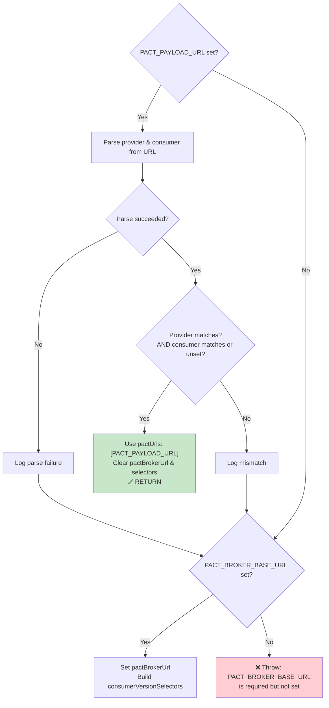

# handlePactBrokerUrlAndSelectors

```typescript
import { handlePactBrokerUrlAndSelectors } from '@seontechnologies/pactjs-utils'
```

A public function that mutates a `VerifierOptions` or
`PactMessageProviderOptions` object in place, setting either `pactUrls` (from
a webhook payload) or `pactBrokerUrl` + `consumerVersionSelectors` (from the
broker).

Both [`buildVerifierOptions`](./build-verifier-options) and [`buildMessageVerifierOptions`](./build-message-verifier-options) call this
internally. It is also exported for cases where you need to build options
manually and then apply URL/selector logic separately.

```typescript
const options: VerifierOptions = {
  provider: 'SampleMoviesAPI',
  providerBaseUrl: 'http://localhost:3001'
}

handlePactBrokerUrlAndSelectors({
  pactPayloadUrl: process.env.PACT_PAYLOAD_URL,
  pactBrokerUrl: process.env.PACT_BROKER_BASE_URL,
  consumer: 'SampleAppConsumer',
  includeMainAndDeployed: true,
  options
})
```

## Parameters

| Name                     | Type                                            | Default | Description                                          |
| ------------------------ | ----------------------------------------------- | ------- | ---------------------------------------------------- |
| `pactPayloadUrl`         | `string \| undefined`                           | --      | Webhook-provided URL. Checked first.                 |
| `pactBrokerUrl`          | `string \| undefined`                           | --      | Broker base URL. Used as fallback.                   |
| `consumer`               | `string \| undefined`                           | --      | Consumer name for selector scoping and URL matching. |
| `includeMainAndDeployed` | `boolean`                                       | --      | Controls selector breadth.                           |
| `options`                | `VerifierOptions \| PactMessageProviderOptions` | --      | The options object to mutate.                        |

## Side Effects

- When payload URL matches: sets `options.pactUrls`, deletes `options.pactBrokerUrl` and `options.consumerVersionSelectors`.
- When falling back to broker: sets `options.pactBrokerUrl` and `options.consumerVersionSelectors`.
- Throws `Error` if neither `pactPayloadUrl` (matching) nor `pactBrokerUrl` is available.

---

## Webhook / Payload URL Handling

In multi-repository setups, the Pact Broker sends a webhook to the provider
repository when a consumer publishes a new contract. The webhook includes a
`PACT_PAYLOAD_URL` pointing to the specific pact that triggered it. The
library uses this URL to verify exactly the right pact, with built-in
protection against cross-execution issues.

### The Cross-Execution Problem

When a provider serves multiple consumers (e.g., `SampleMoviesAPI` for HTTP and
`SampleMoviesAPI-event-producer` for Kafka), a single `PACT_PAYLOAD_URL` set by a
webhook can be consumed by multiple test suites running in the same CI job.
Without validation, the Kafka test suite might attempt to verify an HTTP pact,
or vice versa, causing failures.

### Decision Tree



### URL Parsing

The payload URL follows the Pact Broker convention:

```text
https://broker.example.com/pacts/provider/{ProviderName}/consumer/{ConsumerName}/latest
```

The internal `parseProviderAndConsumerFromUrl` function extracts `ProviderName`
and `ConsumerName` using the regex `/\/pacts\/provider\/([^/]+)\/consumer\/([^/]+)\//`.
Both values are URI-decoded to handle encoded characters.

### Matching Rules

- **Provider must match**: `options.provider === pactUrlProvider`
- **Consumer must match or be unset**: `!consumer || consumer === pactUrlConsumer`

When `consumer` is not specified in the builder call, any consumer in the URL
is accepted as long as the provider matches. This supports the common case
where a provider verifies all consumers.

### Fallback Behavior

When the payload URL does not match (wrong provider, wrong consumer, or
unparseable URL), the function falls through to standard broker-based
verification using `pactBrokerUrl` and consumer version selectors. This means
the test suite always runs -- it just verifies against the broker instead of
the specific webhook payload.

## Related

- [buildVerifierOptions](./build-verifier-options) -- uses this internally
- [buildMessageVerifierOptions](./build-message-verifier-options) -- uses this internally
- [Provider Verifier Overview](./) -- environment variables and examples
